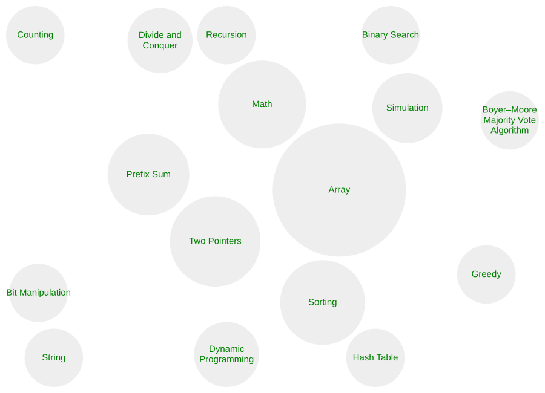

# LeetCode
🎯
Documenting
my DSA
journey
through
LeetCode
solutions in C++
🏆

## 📊 LeetCode Progress

<!-- LEETCODE_PROGRESS_START -->

### 🎯 Total Solved

**35 Problems**

### 📈 Difficulty

| Difficulty | Problems |
|------------|----------:|
| 🟢 Easy | 30 |
| 🟠 Medium | 5 |
| 🔴 Hard | 0 |

### 🧠 Topics

<!-- LEETCODE_PROGRESS_END -->